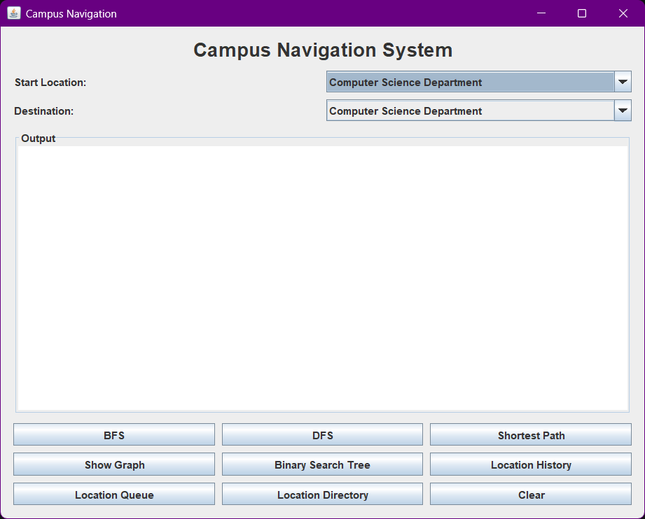
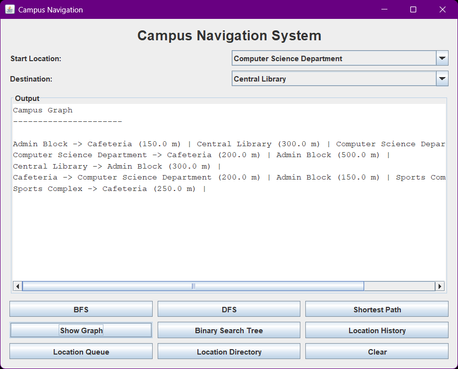
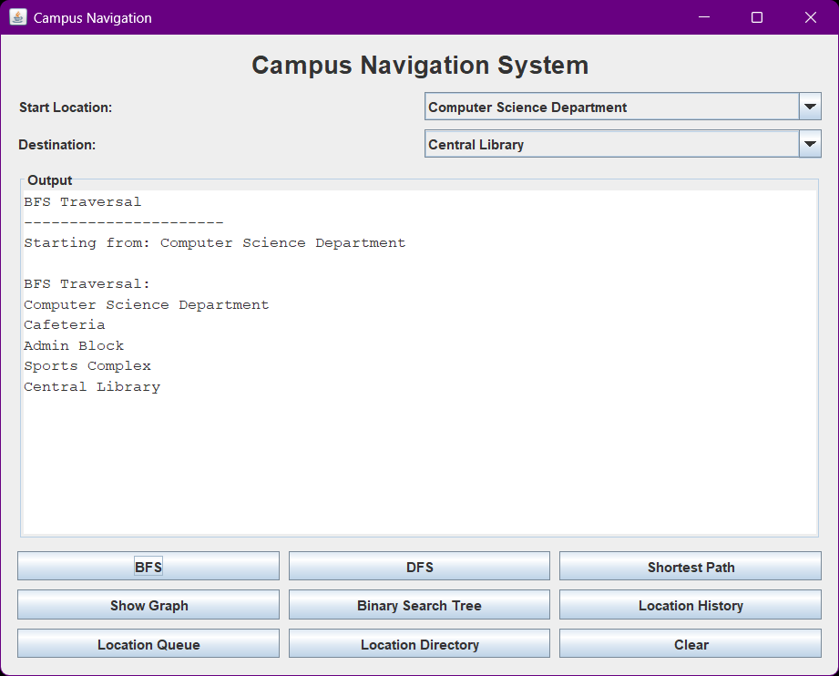
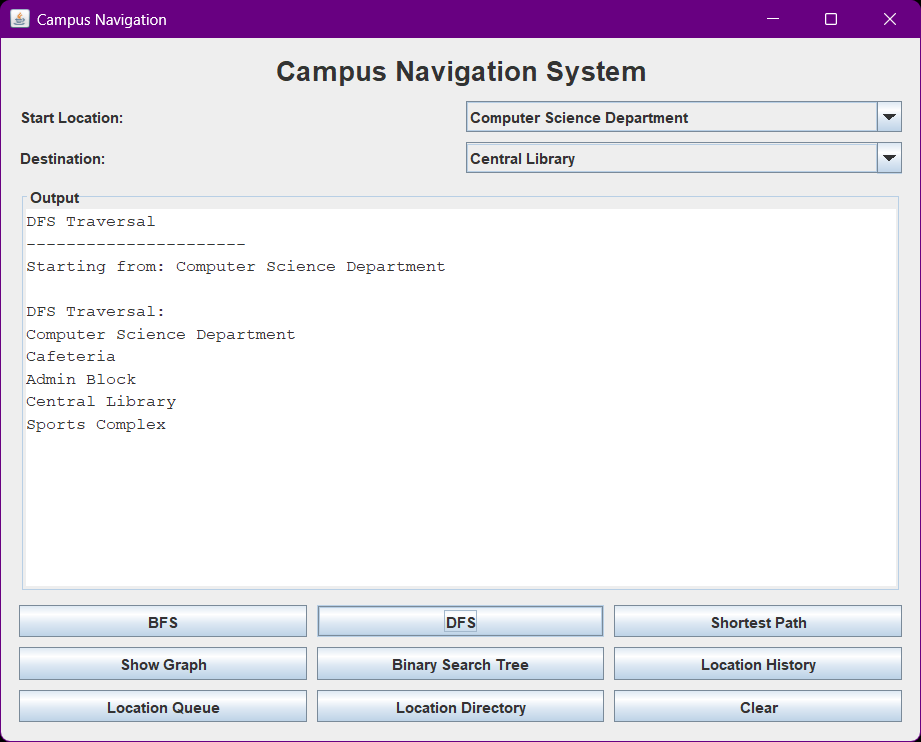
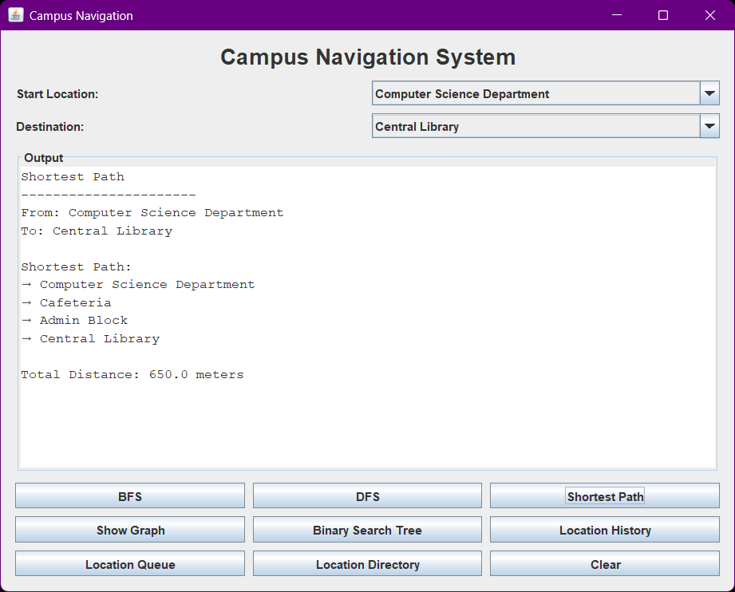
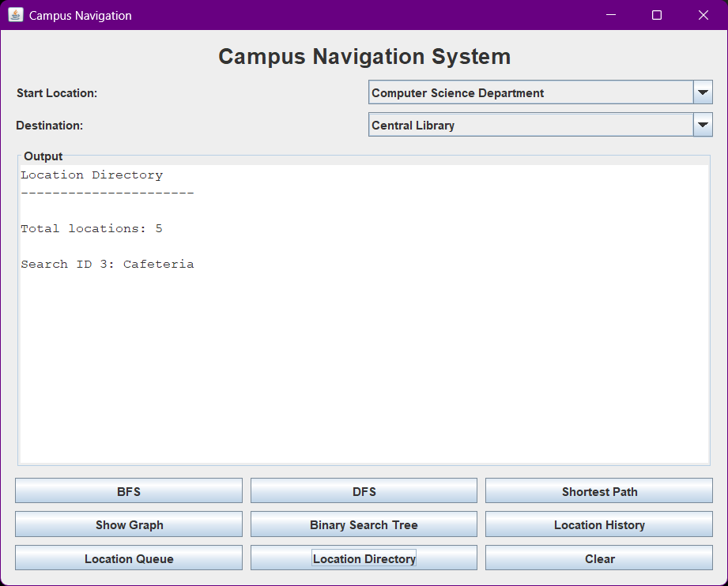

# Campus Navigation System

A Java-based campus navigation system developed to demonstrate
data structures and graph algorithms through a practical
navigation problem.

## Project Overview

The system represents a university campus as a weighted graph.
Different campus locations are represented as vertices, while
connections between locations are represented as weighted edges.

The project implements several data structures and algorithms
to perform campus navigation, searching, traversal, and
shortest-path operations.

A graphical user interface is also included to allow users to
interact with the system.

## Features

- Represent campus locations using a graph
- Display campus connections
- Perform Breadth-First Search (BFS)
- Perform Depth-First Search (DFS)
- Find shortest paths using Dijkstra's algorithm
- Store and search locations using a Binary Search Tree
- Maintain location history using a Stack
- Manage locations using a Queue
- Search campus locations using a Location Directory
- Interactive Java Swing GUI

## Data Structures Used

### Graph

The campus is represented using an adjacency-list-based graph.
Each location is stored as a vertex and each connection contains
a distance value.

### Stack

A stack is used to represent location history.

It demonstrates:

- Push
- Pop
- Peek

### Queue

A queue is used to manage locations in first-in-first-out order.

It demonstrates:

- Enqueue
- Dequeue
- Peek

### Binary Search Tree

A Binary Search Tree is used to store integer values and
demonstrate efficient searching and inorder traversal.

The implementation includes:

- Insertion
- Searching
- Inorder traversal

### Location Directory

A HashMap-based directory is used to store and retrieve campus
locations using their IDs.

## Algorithms Used

### Breadth-First Search

BFS is used to traverse the campus graph level by level starting
from a selected location.

### Depth-First Search

DFS is used to traverse the campus graph by exploring a path
as deeply as possible before backtracking.

### Dijkstra's Algorithm

Dijkstra's algorithm is used to calculate the shortest path
between two campus locations based on their distances.

## Campus Locations

The current system contains five sample locations:

1. Computer Science Department
2. Central Library
3. Cafeteria
4. Admin Block
5. Sports Complex

## Project Structure

```text
src
│
├── algorithms
│   ├── BFS.java
│   ├── DFS.java
│   └── Dijkstra.java
│
├── graph
│   └── Graph.java
│
├── gui
│   └── CampusNavigationGUI.java
│
├── model
│   ├── Edge.java
│   └── Location.java
│
├── services
│   └── NavigationService.java
│
└── structures
    ├── BinarySearchTree.java
    ├── LocationDirectory.java
    ├── LocationQueue.java
    └── LocationStack.java
```

## Screenshots

### Main Interface



### Campus Graph



### BFS Traversal



### DFS Traversal



### Shortest Path



### Location Directory


